<h1 align="center"> Online Garden Shed
</h1>

# Table of Contents

- [Table of Contents](#table-of-contents)
- [Part A](#part-a)
  - [R1 Description](#r1-description)
    - [Purpose](#purpose)
    - [Functionality and features](#functionality-and-features)
    - [Target audience](#target-audience)
    - [Tech stack](#tech-stack)
  - [R2 Dataflow Diagram](#r2-dataflow-diagram)
  - [R3 Application Architecture Diagram](#r3-application-architecture-diagram)
  - [R4 User Stories](#r4-user-stories)
  - [R5 Wireframes for multiple standard screen sizes](#r5-wireframes-for-multiple-standard-screen-sizes)
      - [Figma web site: https://www.figma.com/file/zXPD2YTybFoBeYqFgF6pu2/Wireframes?node-id=44%3A24](#figma-web-site-httpswwwfigmacomfilezxpd2ytybfobeyqfgf6pu2wireframesnode-id443a24)
  - [R6 Screenshots of Trello](#r6-screenshots-of-trello)
      - [Trello web site : https://trello.com/b/CYzn0Wex/online-garden-shed](#trello-web-site--httpstrellocombcyzn0wexonline-garden-shed)
- [Part B](#part-b)
  - [GitHub repository link](#gitHub-repository-link)
  - [Deployed App Link](#deployed-app-link)
  - [R2 Libraries](#r2-libraries)
  - [R8 User Testing Evidence](#r8-user-testing-evidence)
  - [R9 Test Framework Guide](#r9-test-framework-guide)
  - [User Guide](#user-guide)

   

# Part A

# R1 Description
## Purpose
Online Garden Shed is for improving your gardening skills by keeping track of a plant's growth history and learning from other gardeners' experiences. It also provides a way for gardeners to be a part of a much bigger community by bringing their records and experiences online. By having access to the online garden sheds and setting up notifications, gardeners can be more actively involved in their gardening community not restricted by their location.

## Functionality and features
**Storing plants history**: By allowing users to keep a history of their plants, it will help them and others to have greater success when it comes to growing the same plant. Things like soil ph, watering frequency, climate, fertilising, pests, image uploads, etc will all be useful information that a user can see in a plant's history. 
**Image uploading**: Through the process of creating and updating a plant record, you're able to upload images at the beginning and as you continue to grow the plant, you can update it with new images showing a plant's progress. 
**REST API for plants**: When creating a new plant record, the user will need to specify the correct name. For this purpose, the API will help to easily define the plant's name and some general information about the plant. This will ensure some consistency for users browsing the same plant grown from different garden sheds. 
**Browsing other garden sheds**: Not only can a user look over their plant records, but they can view other garden shed records provided they've been made public.
**Following other garden sheds**: A user can follow other garden sheds and have a quick access menu to those sheds and also set up email notification of any updates to anything within a specific shed they follow. 
**Following plants**: A user can follow a specific plant instead of a garden shed. This means they will see the same plant grown by many different garden sheds. 
**Authentication and authorization**: Google OAuth will be implemented for easy authentication and authorisation. 
**Email notifications**: A user can receive email notifications on different updates, like any within a garden shed, or a specific plant that they follow.

## Target audience
* It is suitable for everyone, but particularly for those interested in gardening and especially anyone who is either a beginner and needs guidance and examples to follow or someone with more experience who wants to keep their own records and share them with the gardening community.

## Tech stack
* Mongo DB: Database to store user authentication information and plants growth history
* Express JS: Back-end web application framework
* React JS: Front-end web application library
* Node JS: JavaScript runtime environment
* AWS S3 Bucket or Cloudinary: Cloud storage for holding the plant images
* react-google-login: Node module for Google OAuth login process in React JS
* passport: Node module for authentication and authorization in Express JS
* passport-google-plus-token: Node module for Google OAuth login process in Express JS
* jwt: Node module for the authentication communication between React JS and Express JS
* nodemailer: Node module for sending email notifications

[Go back](#table-of-contents)   

# R2 Dataflow Diagram
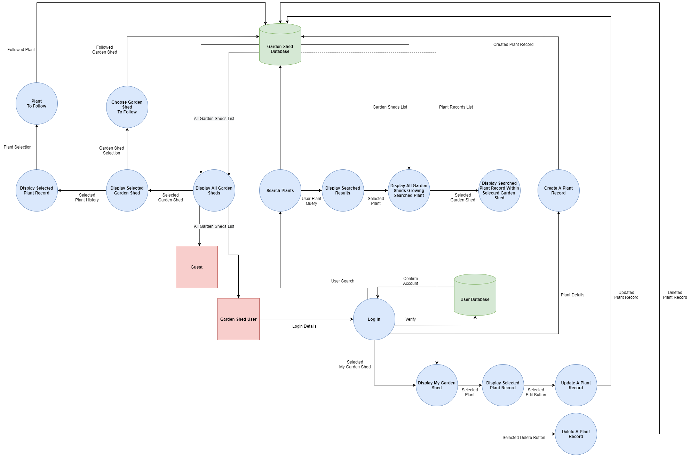

[Go back](#table-of-contents)   

# R3 Application Architecture Diagram
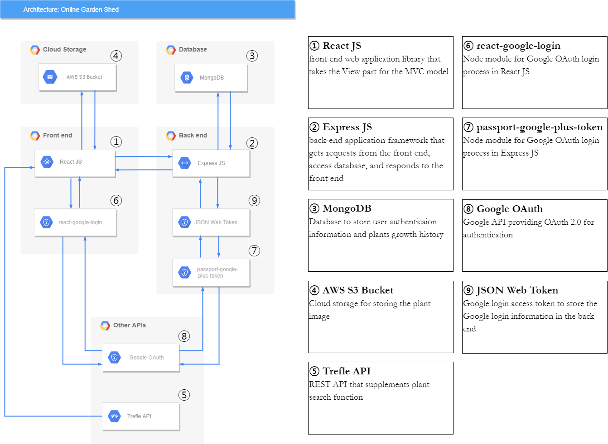

[Go back](#table-of-contents)   

# R4 User Stories
* As a guest, I want to be able to see other users garden shed plant history without the need of signing up, so I can look around and without any obligations.
* As a user, I want to be able to sign up or log in, so I can create plant history with photos and written logs.
* As a user, I want to create plant history with photos and written logs, so I can maintain the history of a plant's growth.
* As a user, I want to be able to search for plants during the creation of a new plant log, so I can bring up detailed info about that specific plant.
* As a user, I want to be able to browse MY OWN garden shed plant history list, so I can update or delete a specific plant history.
* As a user, I want to be able to update or delete the history of a plant's growth, so I can learn and share previous gardening attempts with myself and for other users.
* As a user, I want to be able to get email notifications when it comes time to water or fertilise the plants, so I can stick to the schedule.
* As a user, I want to be able to search a specific plant, so I can look at the history and follow the progress of a specific plant grown by many garden sheds.
* As a user, I want to be able to follow a specific plant, so I can get email notifications when the plants that I follow are updated.
* As a user, I want to be able to follow other garden sheds, so I can get email notifications when the following garden sheds update any plant history.
* As a user, I want to be able to get email notifications when the garden shed that I am following updates any plant history, so I can keep updated with the progress of any plant records.

[Go back](#table-of-contents)   

# R5 Wireframes for multiple standard screen sizes
### Figma web site: https://www.figma.com/file/zXPD2YTybFoBeYqFgF6pu2/Wireframes?node-id=44%3A24
 

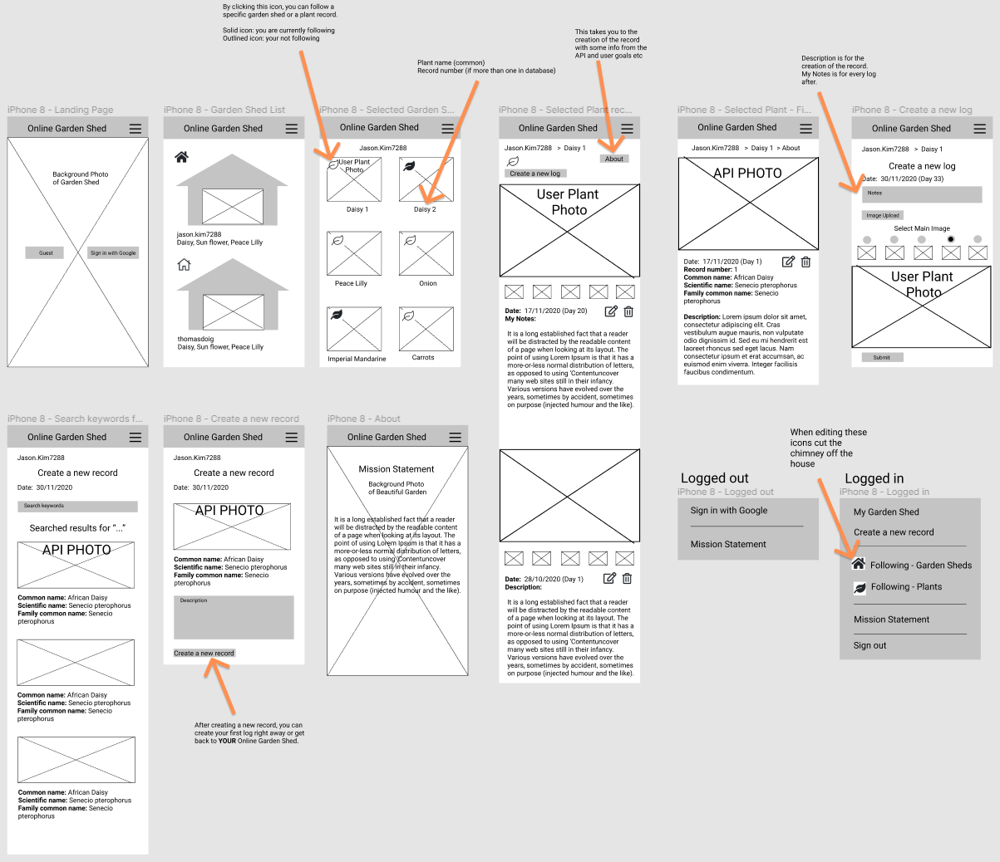
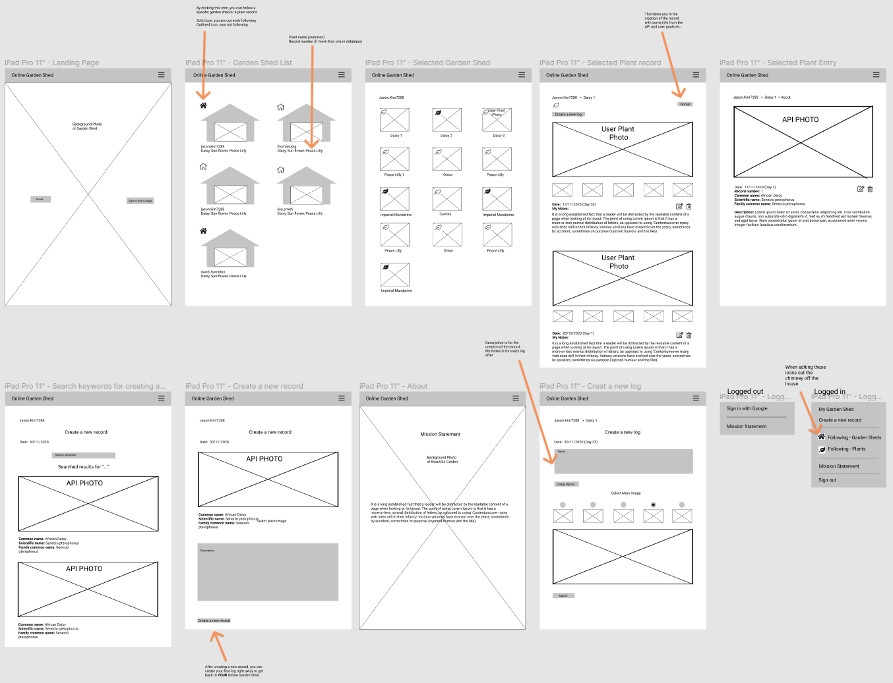
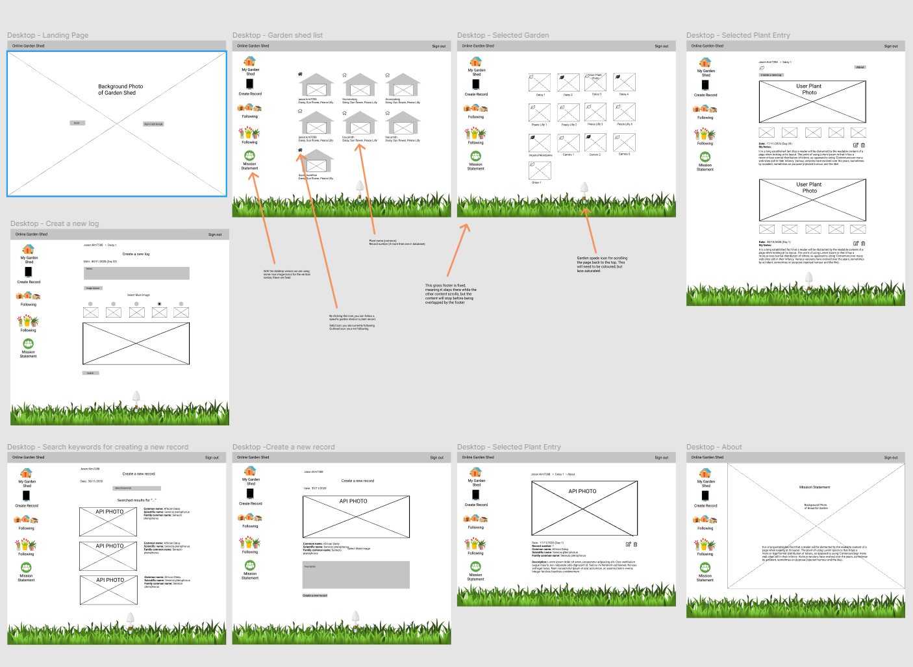

[Go back](#table-of-contents)   

# R6 Screenshots of Trello

### Trello web site : https://trello.com/b/CYzn0Wex/online-garden-shed
24-11-2020
Day 1 was started with making user stories and a trello board. 
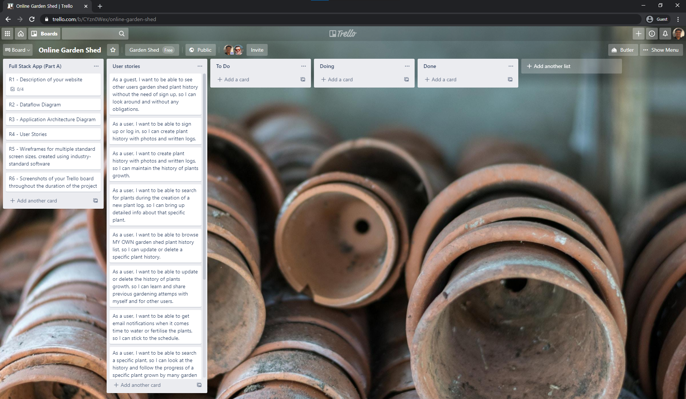

### 25-11-2020
On day 2, we finished writing the description of the website and user stories 
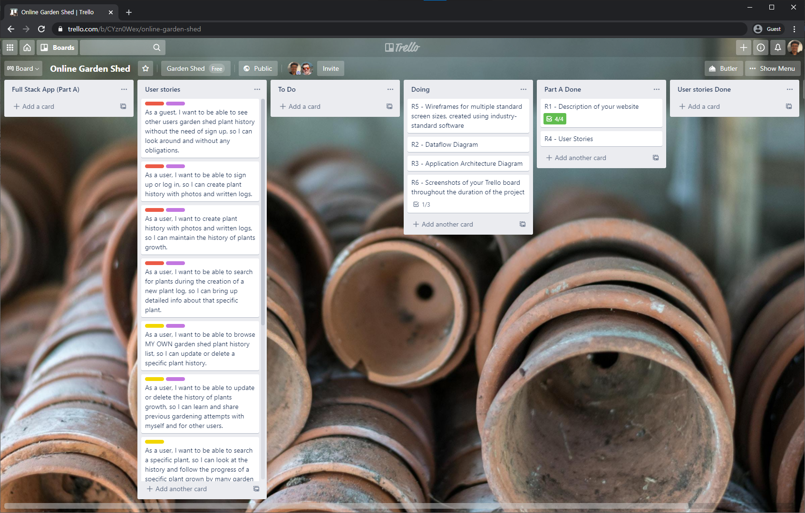

### 30-11-2020
On day 4, we finished Dataflow Diagram, Application Archtecture Diagram and Wireframes for Mobile. 
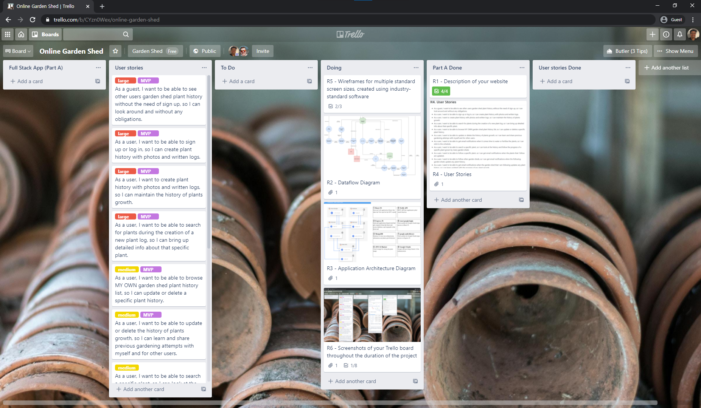

### 01-12-2020
On day 5, we finished Wireframes for Tablet and Desktop. 
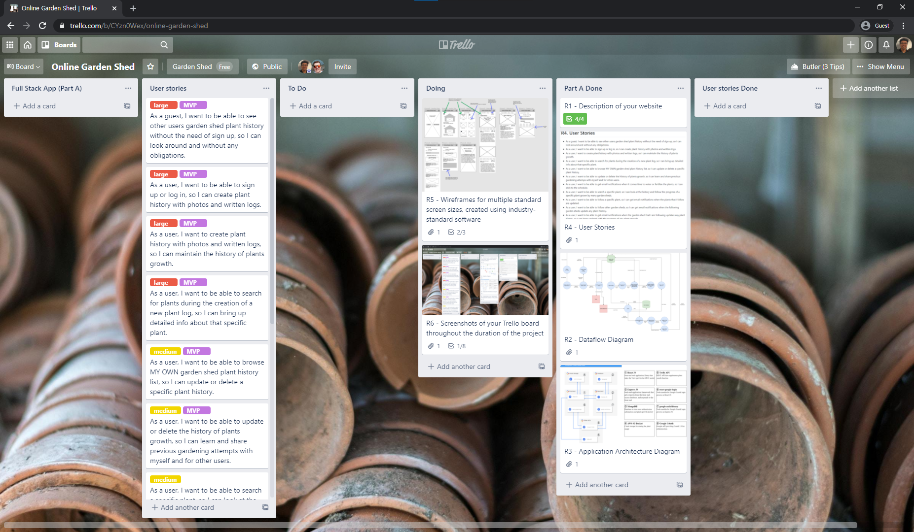

### 07-12-2020
On day 6, we implemented the ability for a logged in user to see their own plant records and see other user plant records. 
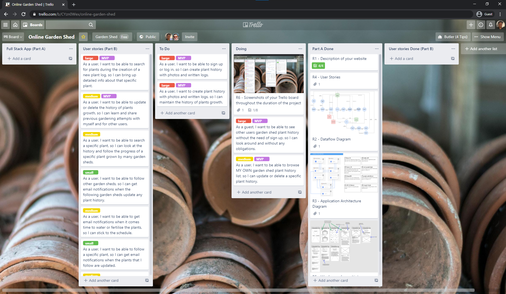

### 09-12-2020
On day 8, we continued to work on the ability to create a new plant record by first searching the trefle plant api. 
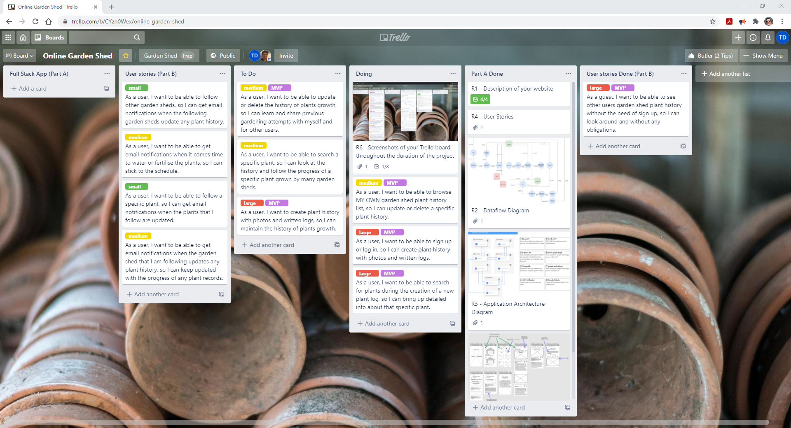

### 11-01-2021
On day 9, we added the ability to upload photos to aws s3 bucket and create new plant logs for the plant record. 
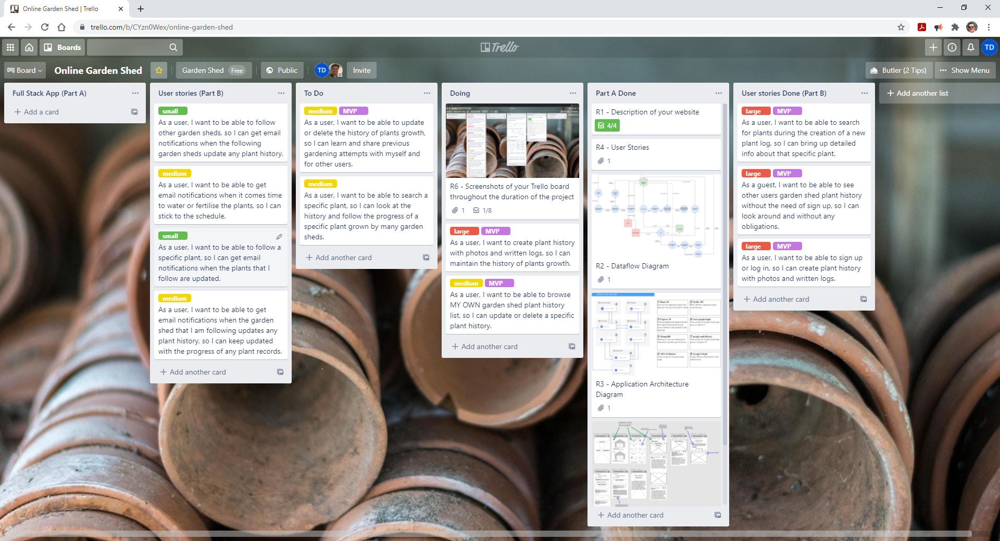

### 13-01-2021
On day 11, we added the ability to follow garden sheds and plants records, along with deploying the front end to Netlify.  
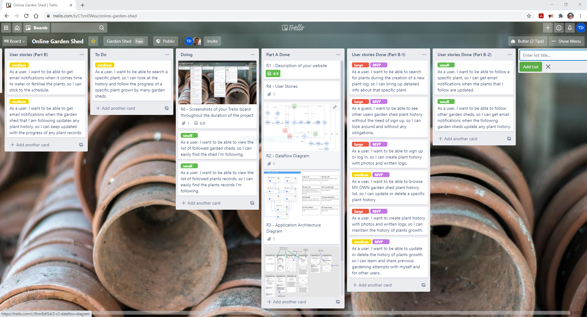

### 18-01-2021
On day 12, we were onto the testing using a testing framework. We also added a user guide. 
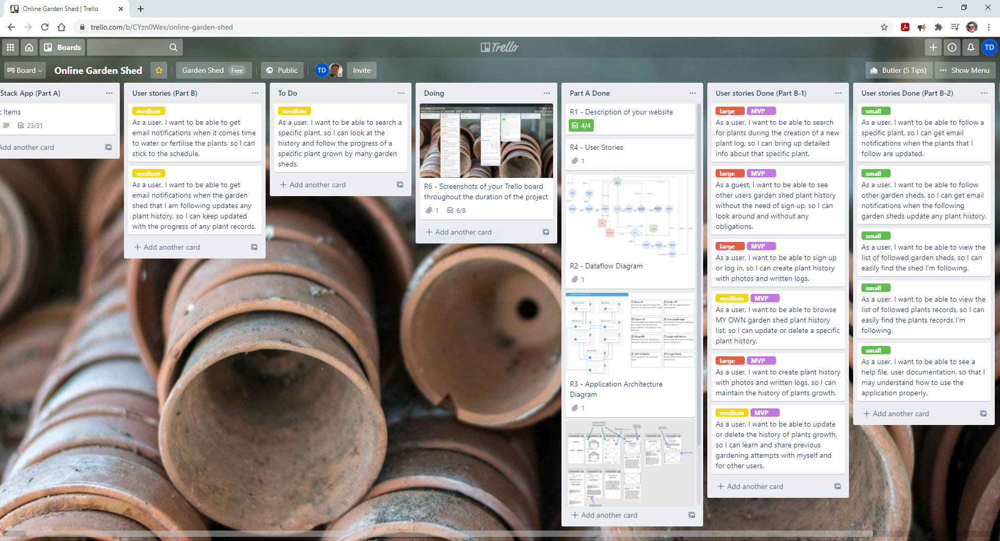

# Part B

## GitHub repository link

Front End GitHub repository link: https://github.com/glowingmoth/online-garden-shed-client

Back End GitHub repository link: https://github.com/jasonkim7288/online-garden-shed-server

[Go back](#table-of-contents)   

## Deployed App Link
Deployed app link: https://onlinegardenshed.netlify.app

Server API link: https://garden-shed.herokuapp.com

[Go back](#table-of-contents)   

# R2 Libraries

## Front End
### Axios
Axios is a JavaScript based library for making HTTP requests using node.js
that supports promises. One of the reasons for choosing axios is that it improves upon the already available .fetch(), in that the syntax is easier to memorise as we don't have to pass our response to the .json to get our data, it's just returned as we need it. Another thing is that axios offers better error handling than fetch(). Logging errors with fetch() can be more work and tricky as it doesn't reject based on HTTP status codes, it only rejects on network failures or anything that prevents the request from completing. This can make debugging with fetch() harder. This is why we used axios in our application.

### react-confirm-alert
react-confirm-alert is a react library for displaying a modal window that has two buttons and has the event handler. In our project, this library is used when the user tries to delete a plant record or a plant log the modal window pops up and ask the confirmation.
### react-router-dom
react-router-dom is for implementing a router that assigns each URL request into the proper main component. It is also used for extracting params and queries from the URL, linking to another URL, and accessing the URL that the customer requested.

### react-google-login
react-google-login is for authentication of Google OAuth for the front end. It offers two components which are google sign in and google sign out, and each component has a callback function that is called when the user finishes the interaction with the google login page. Once the success of the login happens, the login callback function gets the access token which can be used to do the login process with the back end.

### react-s3
react-s3 is for storing the plants' logs photos in the cloud which is the Amazon S3 bucket. After the File object is delivered to the S3 bucket, the public URL for the file is returned and used for storing a plant log through the back end.

### html-react-parser
html-react-parser is a react library that parses the html code and displays it properly. It is used for converting 'new line' html code to be displayed with a real new line on the page in the notes of the plant record and the plant log.

### cypress
cypress is a test framework that handles all the unit tests and integration tests.
In our project, all the functions in '/src/utilities' directory are unit tested by using cypress, and components for sheds, plants records, and plants logs are integration tested with cypress.

## Back End
### axios
axios for the back end is the same library like the one in the front end.

### connect-mongo
connect-mongo is a MongoDB related library that stores the sessions which have an access token for google Oauth into the MongoDB. When the express-session is created, this connect-mongo's instance is passed.

### cookie-parser
cookie-parser is for manipulating cookies from the back end. In this project, it is used for storing and accessing the session id in the cookie.

### cors
cors is for accepting the client's request only from the specific URLs. In this project, only 'http://localhost:3000' and 'https://onlinegardenshed.netlify.app' are allowed to request to the back end.

### dotenv
dotenv is a library that allows you to access the environment variables using 'process.env.' on the left side of the environment variable. It also gives a choice about which .env file should be used depending on the node environment such as development mode or test mode.

### express
express is the core web framework for the back end, and all routing and middleware functions are run by this framework
### express-promise-router
express-promise-router is a simple wrapper library that returns promises.

### express-session
express-session is for creating a session middleware to manage the sessions. In this project, the sessions managed by this library are stored in MongoDB by adding connect-mongo.

### joi
joi is a client request validation library that verifies the URL's parameters and queries and request's body. If the validation's result is failed, the response will be delivered with a 400(Bad Request) error.

### jsonwebtoken
jsonwebtoken is the library that secures the session information between the front end and the back end. In this project, each user's google id is signed with jsonwebtoken and saved in the session storage which is MongoDB

### mongoose
mongoose is a MongoDB database interface library that communicates between the back end and MongoDB. In this project, we defined 4 schemas which are plant record, plant, shed, and user schema, and connect to MongoDB with mongoose.

### morgan
morgan is a library for logging HTTP requests as a middleware. It displays which HTTP requests have been requested and how long it took to return the response.
### passport
passport is an authentication library(middleware) for Node.js. It manages login,  logout, and user details. In this project, passport-google-token strategy and passport-jwt strategy are used for google authentication.
### passport-google-token
passport-google-token is one of the passport strategies that authenticates with Google access tokens using OAuth 2.0API. The front end sends POST request with access_token as a body parameter, then passport-google-token gets the access_token value, accesses the google OAuth server, and gets the profile of the user if the access_token is valid. This profile is used to create a new user account in MongoDB.

### passport-jwt
Because passport-google-token can work only if the access_token is delivered from the front end which is not suitable for every other request, passport-jwt plays a role for other requests such as creating, editing, and deleting a plant record or a plant log except for the login request. passport-jwt uses a cookie and session to verify the user.

### chai
chai is a test library for doing unit tests and integration tests. It is an assertion library, so it gives many kinds of assertion test functions such as expect(), to, be, a(), equal(), etc.

### chai-http
chai-http is for HTTP integration tests with chai assertions. It provides request function such as get(), post(), put() and delete().

### mocha
mocha is a test framework running on Node.js. In this project, chai and chai-http are running in the mocha environment.

### nodemon
nodemon is a development library to restart the application automatically whenever the code is changed.

[Go back](#table-of-contents)   

# R8 User Testing evidence

## Development testing
https://docs.google.com/spreadsheets/d/1tiJRyo4OMuXhouiIHRVT7lcY8jkU2_rm5WxV7fRZGGo/edit#gid=1456122697

## Production testing
In production testing, because we didn't have any actual client, our wives performed the tests for us.

https://docs.google.com/spreadsheets/d/1hpCwYT9Q_hkDr-YFay0JbqV21VNYKcV1YHHXgnsPK7E/edit#gid=0

[Go back](#table-of-contents)   

# R9 Test Framework Guide
## Front-end testing
### This test can work only on Mac, Linux or WSL2 (not work on WSL1)
1. Download source code
2. 'yarn install' after going to the root folder
3. 'yarn start'
4. Visit https://developers.google.com/oauthplayground
5. Find and unfold 'Google OAuth2 API v2
6. Check https://www.googleapis.com/auth/userinfo.email
7. Check https://www.googleapis.com/auth/userinfo.profile
8. Hit the button 'Authorize APIs'
9. Select the Google Account you want to test
10. Hit the button 'Exchange authorization code for tokens
11. Go back to 'Step 2 Exchange authorization code for tokens'
12. Copy Access token and paste it into 'cypress.json' file with the value of the key 'accessToken' (replace the value)
13. Keep in mind that this access token is valid for only 1 hour.
14. If it expires, hit the 'Refresh access token' and do step 12
15. Open another terminal in vscode
16. 'yarn run test'
17. Go to cypress app
18. Click 'Run 6 integration specs' (This includes two unit tests spec)

## Back-end testing
1. Download source code
2. 'npm install' after going to the root folder
3. Visit https://developers.google.com/oauthplayground
4. Find and unfold 'Google OAuth2 API v2
5. Check https://www.googleapis.com/auth/userinfo.email
6. Check https://www.googleapis.com/auth/userinfo.profile
7. Hit the button 'Authorize APIs'
8. Select the Google Account you want to test
9. Hit the button 'Exchange authorization code for tokens
10. Go back to 'Step 2 Exchange authorization code for tokens'
11. Copy Access token and paste it into '.env.test' file with the value of the key 'GOOGLE_ACCESS_TOKEN' (replace the value)
12. Keep in mind that this access token is valid for only 1 hour.
13. If it expires, hit the 'Refresh access token' and do step 11
14. Open a terminal in vscode
15. 'npm run test'

[Go back](#table-of-contents)   

# User Guide

## Overview

This user guide serves the purpose of providing the users of the Online Garden Shed application with a complete breakdown of
all the features available to them. In doing so it’s our hope one may reap the maximum benefit that the Online Garden Shed has to offer.
 
The Online Garden Shed application is responsive and mobile-friendly. This means you may view the application on your smartphone graphics tablet, laptop or desktop computer.

## At a glance

Edit a plant record or plant log.

Delete a plant log or entire plant record.

Dark/solid icon indicates plants followed.

Dark/solid icon indicates plants followed.

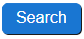
Search for plants to create a record.

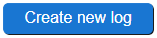
For creating a new log.

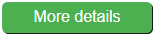
Initial notes of the record.

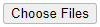
For uploading your plant images.

Adds the log to the record.

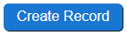
Create New Record

## Guest

At the Landing page you will find the Guest button. Guest mode allows you to access several features in the Online Garden Shed. The following is what you have access to in guest mode.

* All Garden Sheds list
* Plant records
* Mission statement

## Sign in with Google

At the Landing page you will find the Sign in with Google button. You will need a google account for this. Once logged in you will have access to all features of the application. The following are the features you have access to when signed in with google.
* My Garden Shed
* All Garden Sheds list
* Plant records
* Following - Garden sheds
* Following - Plants
* Your following list
* Create plant record
* Create plant log
* Edit plant log
* Edit plant record
* Delete plant log
* Delete plant record
* User Guide
* Mission Statement
* Your profile

## Menus / Navbars

There are two versions of the menu. One is up the top of the screen in mobile devices and smaller screens, while larger screens like laptops and desktop computers use the side navbar.

## Navigating using the paths

In the top of the screen just under the navbar you will see a “path” it is clickable and used to navigate back to the previous page. Each part in the path is separated by ">” to indicate a different page.
 
On the mobile devices you can click the 3 horizontal lines (known as a hamburger menu) in the top right of the screen to access the menu.
At any point in time you can click the Title in the top navbar to get back to the All Garden Sheds list.

## My Garden Shed

This section will contain all of your plant records. When you sign in with google for the very first time your garden shed will be blank. After creating records they will be located here. These records appear as thumbnails (small images) and are clickable.

## Create Record

To create a plant record, click the Create Record button in the menu. Here you will be presented with a search bar that has access to an API for plants. Please note that what’s in this database is out of our control, so we make no guarantees about any particular plant that you’re looking for being available.
 
After typing in your plant name and clicking the Search button on the right you should have a list of plant thumbnails to choose from.
 
Click any of the thumbnails to enter it. From here you will be able to write any initial notes you feel are important. Once done you can click the Create New record button.

## Create New Log

Under the plant record you just created you will see a button Create New Log. Click this to add a new log to the plant record.
 
Within here you will be able to add your notes about growing the plant and also choose upto 5 images per log that you create. To upload photos of your plant click the Choose Files button. When you have chosen your images to upload, take note of the radio buttons above each image thumbnail. This allows you to choose the image you want to set as your main image.
 
Once you’re done you may click the Submit button to add the new log to the plant record. For your benefit there is a Date that is visible for every log added and a day count from the creation of the first record until the most recent log added into you plants record

## Editing and Deleting

You may edit any of your plant records and logs, however it is advised in order to keep the integrity of a plant record that you try to avoid this when you can, except during the creation of a new log.
 
Logs can be easily edited and deleted, but note that when you try and delete a plant record you will be prompted with a pop up message. This is because a plant record contains all the logs for that plant, basically you’ll lose all of the growing history of that plant record.

## Following

Every garden shed and plant record has an icon located in the top left corner. By default it will be an outline/light meaning you’re not currently following it. You may click the icon to start following and it will turn solid/dark.
 
Every garden shed and plant record has an icon located in the top left corner. By default it will be an outline/light meaning you’re not currently following it. You may click the icon to start following and it will turn solid/dark.
 
The Following pages will display all garden sheds and plant records you’re following. You can remove them by clicking the icons and unfollowing them at any time.

[Go back](#table-of-contents)   
